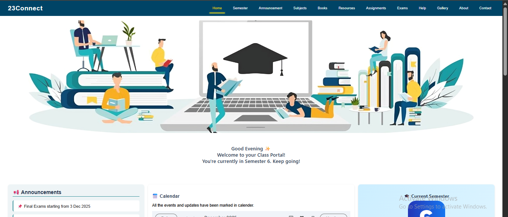
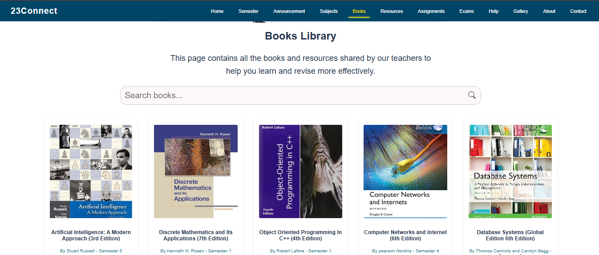
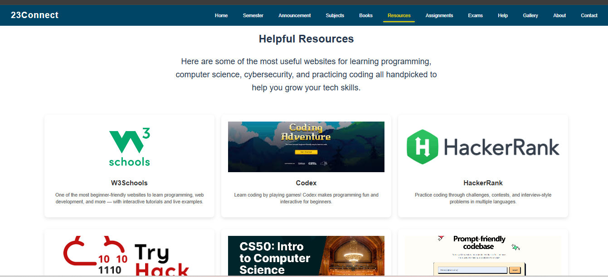
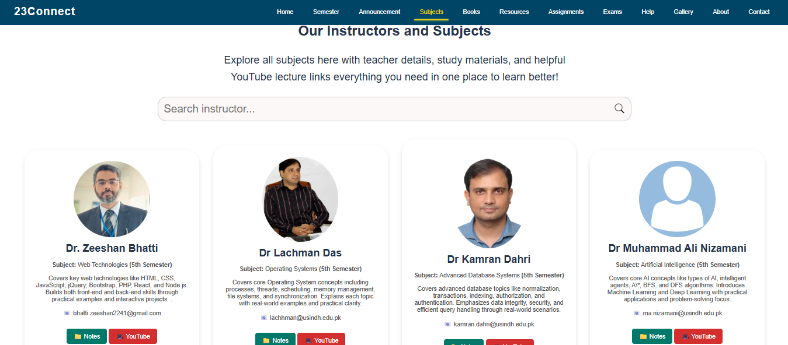
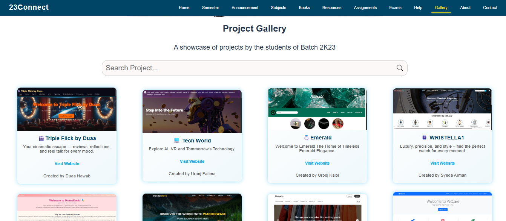
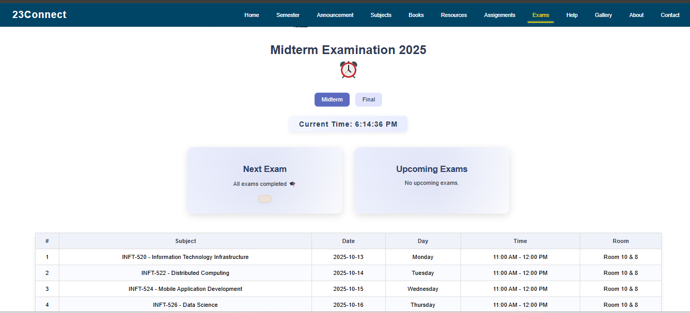
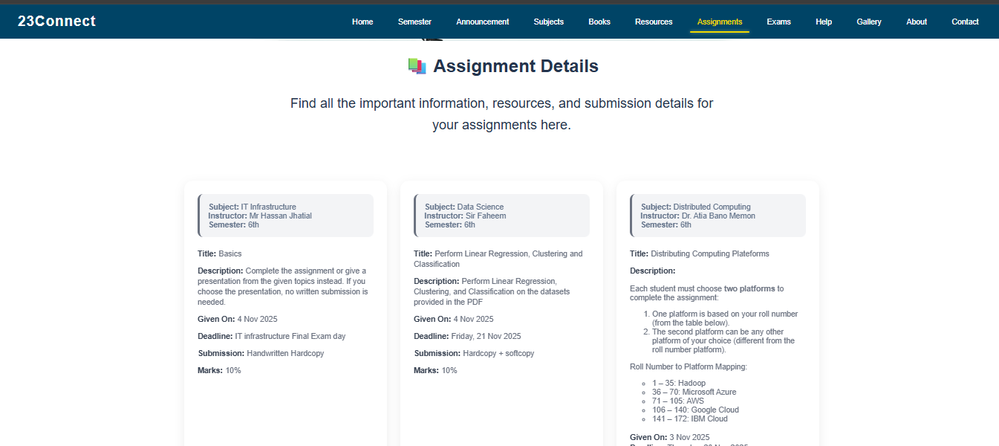
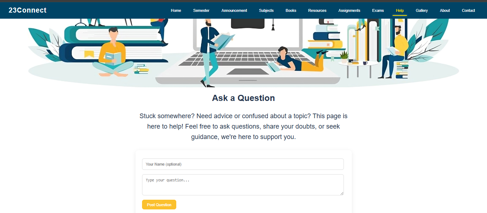
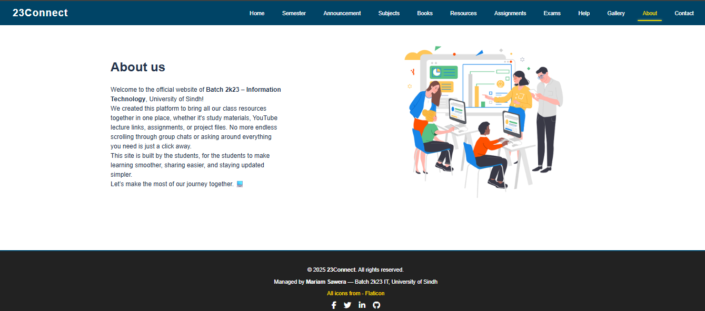
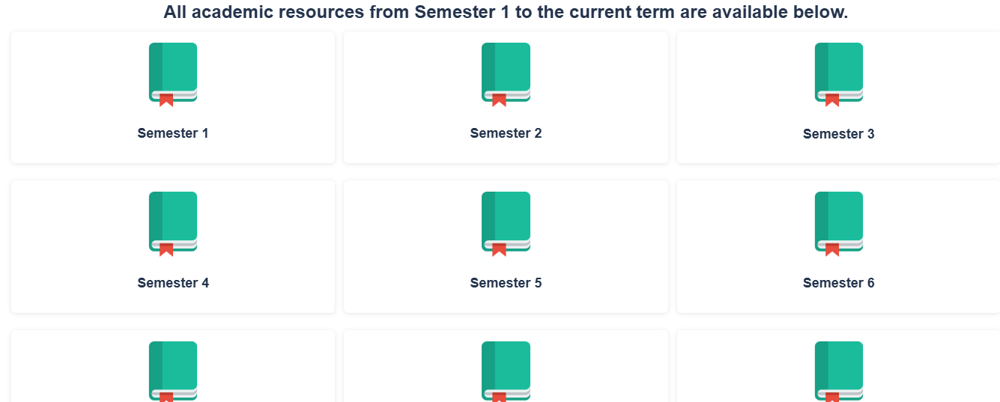

# 🎓 EduNova (23Connect) – Class Resource Hub

**EduNova (also known as 23Connect)** is a centralized class website built to serve as a single hub for all academic resources for me and my classmates. It eliminates the need to ask around for assignments, books, or updates by keeping everything organized and accessible in one place.

This project is currently a static website and is **planned to be redesigned and rebuilt using the MERN stack** with a modern UI and advanced features.

---

## 🌟 Why EduNova?

* 📌 Central place for all class-related materials
* ⏱️ Saves time and reduces confusion
* 🤝 Encourages collaboration among classmates
* 📂 Keeps academic content organized semester-wise

---

## ✨ Features

* 🏠 Home page with quick navigation
* 📢 Announcements & notifications
* 📝 Assignments and exams information
* 📚 Books and learning resources
* 📅 Events and academic updates
* 🧑‍🎓 Semester-wise subjects (Semester 1–8)
* 🖼️ Gallery showcasing classmates’ work
* 📞 Contact & Help pages
* 🔐 Login page (UI-level)

---

## 🛠️ Tech Stack (Current)

* **HTML5** – Structure
* **CSS3** – Styling
* **JavaScript** – Interactivity

---

## 📸 Screenshot

> Home Page Preview













---

## 📂 Project Structure

```text
mariamsawera-edunova/
├── index.html          # Home page
├── about.html          # About platform
├── announcement.html  # Announcements & notices
├── assignments.html   # Assignments
├── books.html          # Books & references
├── exams.html          # Exams information
├── subjects.html       # Subjects overview
├── semester1.html
├── semester2.html
├── semester3.html
├── semester4.html
├── semester5.html
├── semester6.html
├── semester7.html
├── semester8.html
├── gallery.html        # Classmates' work
├── resources.html     # Additional resources
├── contact.html        # Contact page
├── help.html           # Help & support
├── thankyou.html       # Thank you page
├── styles.css          # Main stylesheet
├── script.js           # JavaScript logic
└── images/
    ├── avtar.webp
    ├── linear-algebra.webp
    └── homepage.png   
```

---

## 🚀 How to Run Locally

1. Clone the repository:

```bash
git clone https://github.com/MariamSawera/eduNova.git
```

2. Open `index.html` in your browser.

---

## 🔮 Future Enhancements

* 🔄 Rebuild with **MERN Stack (MongoDB, Express, React, Node.js)**
* 🎨 Modern and responsive UI redesign
* 🔐 Student authentication & roles
* ☁️ Cloud storage for notes and files
* 🔍 Search, filter, and category-based navigation

---

## 👩‍💻 Author

**Mariam Sawera**

* GitHub: [https://github.com/MariamSawera](https://github.com/MariamSawera)

---

⭐ Built to support collaborative learning and designed to grow into a full-fledged academic platform.
